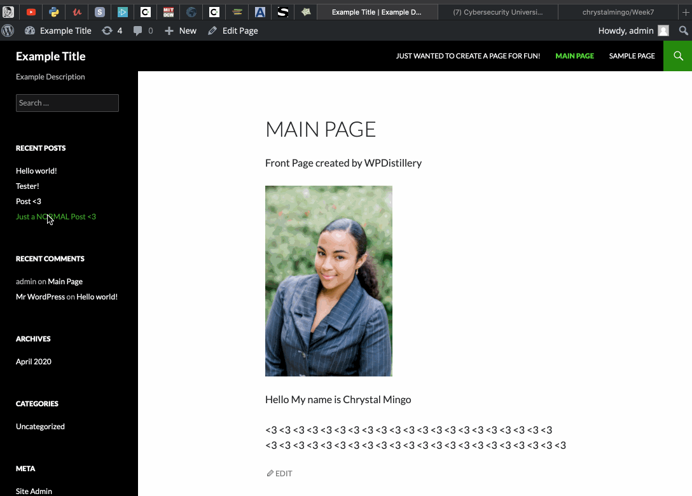

# Project 7 - WordPress Pentesting

Time spent: 9.5 hours spent in total

> Objective: Find, analyze, recreate, and document 3 vulnerabilities affecting an old version of WordPress

## Pentesting Report

1. (Required) Vulnerability: Authenticated Stored Cross-Site Scripting
  - [ ] Summary: 
    - Vulnerability types: XSS
    - Tested in version: 4.2 
    - Fixed in version: 4.3
  - [ ] GIF Walkthrough: 
  
  
  - [ ] Steps to recreate: Make a new post >> Write the following javascript"" Publish it >> Then view to post!
  
2. (Required) Vulnerability: Authenticated Stored Cross-Site Scripting
  - [ ] Summary: 
    - Vulnerability types: XSS
    - Tested in version:4.2
    - Fixed in version: Later Version
  - [ ] GIF Walkthrough: 
  
  - [ ] Steps to recreate: Make a new Post >> Place the text Danger ahead! Potential Hacker
    . You should see something and then an alert appear.
  - [ ] Affected source code:
    - [Link 1](https://core.trac.wordpress.org/browser/branches/4.2/src/wp-admin/includes/image.php)
3. (Required) Authenticated Stored Cross-Site Scripting via Image frame
  - [ ] Summary: 
    - Vulnerability types: XSS
    - Tested in version: 4.2
    - Fixed in version: 4.6.1
  - [ ] GIF Walkthrough: 
  - [ ] Steps to recreate: Upload a new image to the library >> Then click on that image >> After that update the images name with the text ---> ImageName.png
    
    ## Resources

- [WordPress Source Browser](https://core.trac.wordpress.org/browser/)
- [WordPress Developer Reference](https://developer.wordpress.org/reference/)

GIFs created with [LiceCap](http://www.cockos.com/licecap/).

## Notes

Describe any challenges encountered while doing the work

## License

    Copyright [2020] [Chrystal Mingo]

    Licensed under the Apache License, Version 2.0 (the "License");
    you may not use this file except in compliance with the License.
    You may obtain a copy of the License at

        http://www.apache.org/licenses/LICENSE-2.0

    Unless required by applicable law or agreed to in writing, software
    distributed under the License is distributed on an "AS IS" BASIS,
    WITHOUT WARRANTIES OR CONDITIONS OF ANY KIND, either express or implied.
    See the License for the specific language governing permissions and
    limitations under the License.
